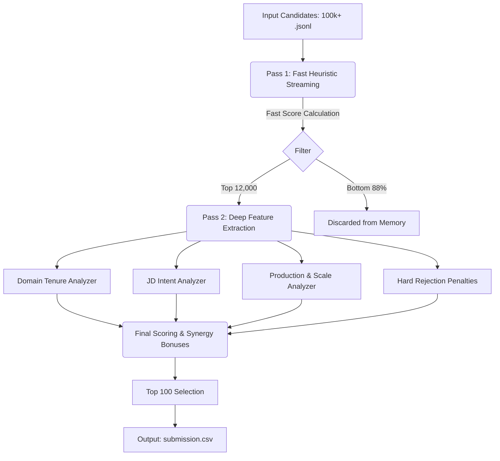

# Redrob AI Candidate Ranker

A hyper-optimized, pure-Python candidate ranking engine built for the Redrob AI Senior AI Engineer (Founding Team) challenge. 

This system parses massive JSONL candidate pools and identifies the top 100 candidates by extracting deep semantic evidence of production-scale retrieval, search, and recommendation systems.

## System Architecture

The engine is constrained to a strict 5-minute CPU-only execution budget without external LLM APIs. To achieve this, it utilizes a Two-Pass Filtering Pipeline.



1. **Pass 1: Fast Heuristic Streaming** 
   Streams the massive input in chunks, applying a lightweight regex-based heuristic to score candidates in milliseconds. It immediately discards the vast majority of candidates, keeping only the top 12,000 in memory.
2. **Pass 2: Deep Feature Extraction** 
   The top 12,000 candidates undergo rigorous, full-profile extraction. The system compiles a highly detailed FeatureVector for each candidate, analyzing their entire career trajectory, skill overlap, and explicit project descriptions.

## Scoring Modules (The Feature Vector)

The algorithm operates on the philosophy that **evidence of shipping > keyword tags**. The Technical Fit score is composed of the following distinct analyzers:

* **Domain Tenure (Anchor)**: Calculates explicit months spent working in search/recommendation/retrieval roles. (Max 25 points).
* **JD Intent Matching**: Detects problem-domain alignment. Search, Recommendation, and Marketplace systems are weighted equally (+7 pts). Heavily decays experience older than 5 years.
* **Production & Scale**: Scans for evidence of deploying vector databases (FAISS, Pinecone) and scale indicators (latency, QPS, millions of users).
* **Evaluation Methodology**: Rewards candidates who explicitly measure their ranking systems using NDCG, MAP, MRR, or rigorous offline/online A/B testing.
* **Ownership & Impact**: Determines if the candidate was a lead/owner (0->1 builder) or merely a peripheral contributor.
* **Skills**: Capped heavily at just 1 point. We reward evidence of using a tool in production over merely listing it as a tag.
* **Company Trajectory**: Evaluates if they worked at elite search companies, product companies, or startups.

### Synergy Bonuses
The engine detects incredibly rare, powerful combinations and awards multiplier bonuses:
* **"Ship & Measure"**: Candidates with strong production deployment and rigorous evaluation metrics.
* **"Founding Mindset"**: Explicit evidence of building "0->1", "greenfield", or "v1" systems from scratch.

## Strict Hard Rejection Rules

The ranker applies uncompromising penalties (-100 points) to instantly drop mismatched candidates to the bottom of the list:

* **Pure Academic Researchers**: Candidates with extensive academic research hits but zero evidence of shipping models to production users.
* **No Production Evidence**: Generic ML engineers who have never explicitly deployed, scaled, or optimized a production system.
* **CV/Speech Specialists**: Engineers whose profiles are dominated by Computer Vision, Robotics, or Speech processing, lacking core retrieval intent.
* **Consulting-Only**: Candidates who have spent >90% of their career at IT services/consulting firms rather than product companies.
* **Non-Technical Titles**: PMs, HR, Sales, Scrum Masters, or generic Data Entry profiles masked by AI buzzwords.

## Hiring Readiness

After the technical score is capped at 95.0, the final 5.0 points are reserved for Behavioral/Hiring signals:
* **Notice Period**: Rewards immediate joiners (< 30 days) and penalizes 90+ day notice periods.
* **Location Fit**: Rewards candidates currently in preferred Indian tech hubs or those explicitly marked open_to_relocate.

## How to Reproduce

`rank.py` uses only the Python standard library. It performs no network calls and requires no GPU.

```bash
# Verify no external dependencies are needed
pip install -r requirements.txt

# Run the full pipeline
python rank.py --candidates ./candidates.jsonl --out ./bug_hunters.csv

# Validate the final output structure
python validate_submission.py ./bug_hunters.csv
```

### Files Overview
* `rank.py`: The main CLI wrapper script to execute the pipeline.
* `src/`: Core modular package containing the ranking engine.
  * `schemas.py`: Data models and `dataclass` definitions.
  * `constants.py`: Taxonomy definitions, compiled regular expressions, and configuration constants.
  * `utils.py`: Utility functions like date parsers and text extraction logic.
  * `fast_filter.py`: Stage 1 streaming heuristics (`fast_score`) and honeypot detection.
  * `analyzers.py`: Independent analyzer functions and master `extract_features` merger.
  * `scoring.py`: Central scoring logic, penalty computation, and reasoning generation.
  * `pipeline.py`: Pipeline orchestrator that runs the two-stage execution flow.
* `validate_submission.py`: CSV format validator checking official Redrob submission rules.
* `requirements.txt`: Standard library runtime verification.
* `submission_metadata.yaml`: Team and environment reproduction metadata.
