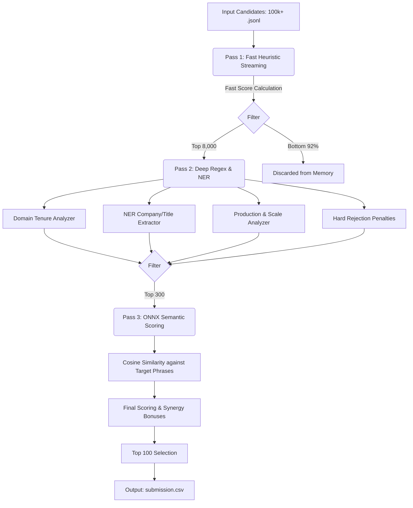

# Redrob AI Candidate Ranker

A hyper-optimized, hybrid AI candidate ranking engine built for the Redrob AI Senior AI Engineer (Founding Team) challenge. 

This system processes 100,000 JSONL candidates locally in ~150 seconds entirely on CPU without any cloud APIs, identifying the top 100 candidates by extracting deep semantic evidence of production-scale retrieval, search, and recommendation systems.

## System Architecture

The engine is constrained to a strict 5-minute CPU-only execution budget without external LLM APIs. To achieve this, it utilizes a heavily optimized Three-Pass Filtering Pipeline, culminating in a local, multithreaded ONNX Semantic Engine.



1. **Pass 1: Fast Heuristic Streaming** 
   Streams the massive input in chunks, applying a lightweight regex-based heuristic to score candidates in milliseconds. Processed 100,000 candidates in **149.6 seconds**. It immediately discards the vast majority of candidates, keeping only the top 8,000 in memory.
2. **Pass 2: Deep Feature Extraction & NER** 
   The top 8,000 candidates undergo rigorous, full-profile extraction. Uses a lightweight spaCy Named Entity Recognition (NER) pipeline (with pipeline components stripped for speed) alongside advanced regex logic to compile a highly detailed FeatureVector - Uses `concurrent.futures.ThreadPoolExecutor` to multi-thread evaluations across 8,000 candidates.
3. **Pass 3: Semantic Understanding (ONNX CPU Execution)**
   The top 300 candidates are processed by a localized `all-MiniLM-L6-v2` embedding model. The model runs using `onnxruntime` with Graph Optimization and Intra-op Multithreading enabled to achieve blazing-fast CPU inference. It computes cosine similarities against ideal JD phrases to catch synonyms, paraphrasing, and negation.

## Scoring Modules (The Feature Vector)

The algorithm operates on the philosophy that **evidence of shipping > keyword tags**. The Technical Fit score is composed of the following distinct analyzers:

* **Domain Tenure (Anchor)**: Calculates explicit months spent working in search/recommendation/retrieval roles. (Max 25 points).
* **JD Intent Matching**: Detects problem-domain alignment. Search, Recommendation, and Marketplace systems are weighted equally (+7 pts). Heavily decays experience older than 5 years.
* **Production & Scale**: Scans for evidence of deploying vector databases (FAISS, Pinecone) and scale indicators (latency, QPS, millions of users).
* **Evaluation Methodology**: Rewards candidates who explicitly measure their ranking systems using NDCG, MAP, MRR, or rigorous offline/online A/B testing.
* **Ownership & Impact**: Determines if the candidate was a lead/owner (0->1 builder) or merely a peripheral contributor.
* **Skills**: Capped heavily at just 1 point. We reward evidence of using a tool in production over merely listing it as a tag.
* **Company Trajectory**: Evaluates if they worked at elite search companies, product companies, or startups.

### Synergy Bonuses
The engine detects incredibly rare, powerful combinations and awards multiplier bonuses:
* **"Ship & Measure"**: Candidates with strong production deployment and rigorous evaluation metrics.
* **"Founding Mindset"**: Explicit evidence of building "0->1", "greenfield", or "v1" systems from scratch.

## Strict Hard Rejection Rules

The ranker applies uncompromising penalties (-100 points) to instantly drop mismatched candidates to the bottom of the list:

* **Pure Academic Researchers**: Candidates with extensive academic research hits but zero evidence of shipping models to production users.
* **No Production Evidence**: Generic ML engineers who have never explicitly deployed, scaled, or optimized a production system.
* **CV/Speech Specialists**: Engineers whose profiles are dominated by Computer Vision, Robotics, or Speech processing, lacking core retrieval intent.
* **Consulting-Only**: Candidates who have spent >90% of their career at IT services/consulting firms rather than product companies.
* **Non-Technical Titles**: PMs, HR, Sales, Scrum Masters, or generic Data Entry profiles masked by AI buzzwords.

## Hiring Readiness

After the technical score is capped at 95.0, the final 5.0 points are reserved for Behavioral/Hiring signals:
* **Notice Period**: Rewards immediate joiners (< 30 days) and penalizes 90+ day notice periods.
* **Location Fit**: Rewards candidates currently in preferred Indian tech hubs or those explicitly marked open_to_relocate.

## How to Reproduce

`rank.py` is designed to be completely offline, making it highly suitable for Hugging Face Spaces and restricted execution environments.

### Pre-computation & Assets

Before running, the system requires the local ONNX embedding model and spaCy NER model to be available offline. These are downloaded during the build step.
If you are deploying to Hugging Face or another fresh environment, you must run the asset downloader first.

The `download_offline_assets.py` script specifically downloads:
1. **spaCy `en_core_web_sm`**: A lightweight English NLP model used for extremely fast Named Entity Recognition (NER) to pull organization names.
2. **`all-MiniLM-L6-v2`**: A Sentence-Transformers embedding model. The script downloads it and automatically exports its weights into ONNX format (`local_onnx_model/`) so it can be run purely on CPU via `onnxruntime`.

If a download fails due to network issues, the script includes a built-in retry mechanism to attempt downloading up to 3 times automatically.

```bash
# 1. Install dependencies
pip install -r requirements.txt

# 2. Download offline models (spaCy en_core_web_sm and sentence-transformers converted to ONNX)
# This step pre-computes the model weights and saves them locally so rank.py does not need internet access.
python download_offline_assets.py

# 3. Run the full pipeline
python rank.py --candidates ./candidates.jsonl --out ./bug_hunters.csv

# 4. Validate the final output structure
python validate_submission.py ./bug_hunters.csv
```

### Files Overview
* `rank.py`: The main CLI wrapper script to execute the pipeline.
* `src/`: Core modular package containing the ranking engine.
  * `schemas.py`: Data models and `dataclass` definitions.
  * `constants.py`: Taxonomy definitions, compiled regular expressions, and configuration constants.
  * `utils.py`: Utility functions like date parsers and text extraction logic.
  * `fast_filter.py`: Stage 1 streaming heuristics (`fast_score`) and honeypot detection.
  * `analyzers.py`: Independent analyzer functions and master `extract_features` merger.
  * `scoring.py`: Central scoring logic, penalty computation, and reasoning generation.
  * `pipeline.py`: Pipeline orchestrator that runs the two-stage execution flow.
* `validate_submission.py`: CSV format validator checking official Redrob submission rules.
* `requirements.txt`: Standard library runtime verification.
* `submission_metadata.yaml`: Team and environment reproduction metadata.
